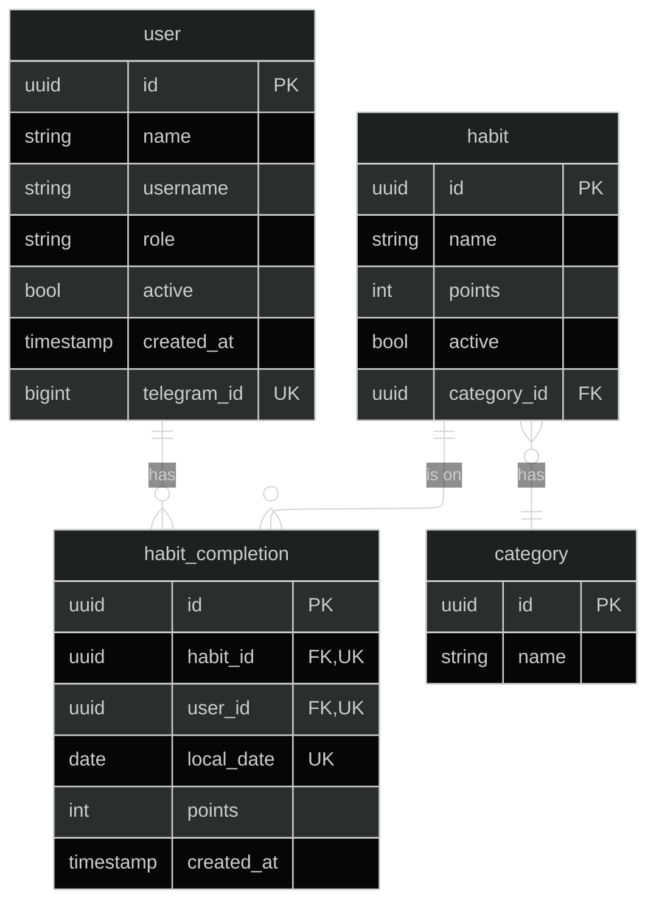

# Data Model

```mermaid
---
config:
  theme: dark
  layout: elk
---
erDiagram
    user ||--o{ habit_completion : has
    habit ||--o{ habit_completion: "is on"
    habit }o--|| category: has
   
    user {
        uuid id PK
        string name
        string username
        string role
        bool active
        timestamp created_at
        bigint telegram_id UK
    }
    habit {
        uuid id PK
        string name
        int points
        bool active
        uuid category_id FK
    }
    category {
        uuid id PK
        string name
    }
    habit_completion {
        uuid id PK
        uuid habit_id FK, UK
        uuid user_id FK, UK
        date local_date UK
        int points
        timestamp created_at
    }
```
